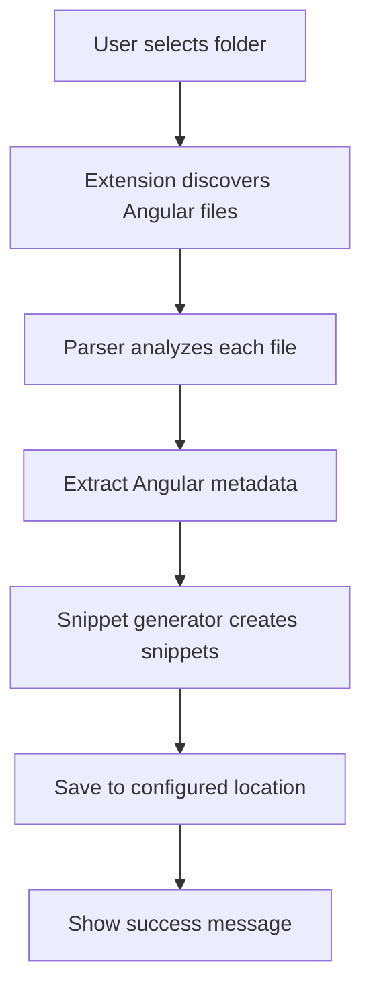

# Architecture Overview

## Overview

The Angular Snippet Generator is a Visual Studio Code extension that automatically generates code snippets for Angular components, directives, and pipes. It analyzes TypeScript source files, extracts metadata from Angular decorators, and creates reusable VS Code snippets that can be used to quickly insert Angular component usage in templates.

## High-Level Architecture

```text
┌─────────────────┐    ┌─────────────────┐    ┌─────────────────┐
│   VS Code       │    │  Extension      │    │   File System   │
│   Integration   │◄──►│  Core Logic     │◄──►│   Operations    │
└─────────────────┘    └─────────────────┘    └─────────────────┘
                              │
                              ▼
                       ┌─────────────────┐
                       │ TypeScript      │
                       │ Compiler API    │
                       └─────────────────┘
```

## Core Components

### 1. Extension Entry Point (`extension.ts`)

**Responsibility:** Main extension activation and VS Code integration

**Key Functions:**

- Registers the `angular-snippet-generator.createSnippets` command
- Handles user interaction through context menus and command palette
- Manages snippet location configuration (workspace vs user)
- Orchestrates the entire snippet generation workflow

**Dependencies:**

- VS Code Extension API
- File system operations
- Parser, Snippet generator, and File utilities

### 2. Parser (`parser.ts`)

**Responsibility:** Static analysis of Angular TypeScript files

**Key Functions:**

- Parses TypeScript source files using the TypeScript Compiler API
- Extracts Angular decorator metadata (@Component, @Directive, @Pipe)
- Identifies inputs, outputs, and selectors from component/directive definitions
- Returns structured AngularInfo objects

**Dependencies:**

- TypeScript Compiler API
- AST node utilities (`nodes.ts`)
- Type definitions (`types.ts`)

### 3. Snippet Generator (`snippet.ts`)

**Responsibility:** Transforms Angular metadata into VS Code snippet format

**Key Functions:**

- Converts Angular component/directive metadata into JSON snippets
- Generates appropriate prefixes and descriptions
- Creates tab stops for inputs, outputs, and event handlers
- Formats component names and property names appropriately

**Dependencies:**

- String utilities (`strings.ts`)
- Type definitions (`types.ts`)
- Constants (`constants.ts`)

### 4. File System Operations (`files.ts`)

**Responsibility:** File discovery and I/O operations

**Key Functions:**

- Discovers Angular files in selected directories
- Reads file contents
- Writes generated snippet files
- Supports dependency injection for testing

**Dependencies:**

- Node.js fs module
- Path utilities

### 5. AST Node Utilities (`nodes.ts`)

**Responsibility:** TypeScript AST traversal and analysis helpers

**Key Functions:**

- Type guards for different AST node types
- Property extraction from decorator objects
- Type analysis for Angular decorators

**Dependencies:**

- TypeScript Compiler API

### 6. Type Definitions (`types.ts`)

**Responsibility:** Core data structures and interfaces

**Key Interfaces:**

- `ComponentInfo`, `DirectiveInfo`, `PipeInfo` - Angular artifact metadata
- `Property` - Input/output property definitions
- `Snippet` - VS Code snippet format
- `FileSystemProvider` - Abstraction for file operations

### 7. String Utilities (`strings.ts`)

**Responsibility:** Text processing and formatting

**Key Functions:**

- Case conversion (kebab-case to title case)
- Component name formatting
- Event handler name generation

### 8. Constants (`constants.ts`)

**Responsibility:** Configuration and enumeration values

**Key Constants:**

- Artifact types (Component, Directive, Pipe)
- File paths and directories
- Configuration keys
- Supported file extensions

## Data Flow



### Detailed Workflow

1. **Discovery Phase**
   - User right-clicks on a folder and selects "Create Angular Snippets"
   - Extension scans for `.component.ts`, `.directive.ts`, `.pipe.ts` files
   - Filters out test files and unsupported formats

1. **Analysis Phase**
   - Each Angular file is parsed using TypeScript Compiler API
   - AST is traversed to find Angular decorators
   - Metadata is extracted: selectors, inputs, outputs, class names

1. **Generation Phase**
   - Metadata is transformed into VS Code snippet JSON format
   - Prefixes are generated from selectors and class names
   - Tab stops are created for interactive elements

1. **Storage Phase**
   - Snippets are saved to user-configured location
   - Either workspace `.vscode/snippets/` or global user snippets
   - Existing snippets are merged with new ones

## Design Decisions

### 1. TypeScript Compiler API

**Rationale:** Provides robust, type-safe parsing of TypeScript/Angular code without requiring runtime execution.

**Benefits:**

- Handles complex TypeScript syntax
- Type information available for better analysis
- No need to bundle Angular runtime

### 2. Modular Architecture

**Rationale:** Clear separation of concerns enables maintainability and testability.

**Benefits:**

- Each module has a single responsibility
- Easy to unit test individual components
- Facilitates future enhancements

### 3. Dependency Injection for File System

**Rationale:** Enables testing without actual file system operations.

**Benefits:**

- Unit tests can use mock file systems
- Easier testing of file discovery logic
- Abstraction allows for different storage backends

### 4. Configuration-Driven Location Selection

**Rationale:** Users have different preferences for snippet storage.

**Benefits:**

- Supports both individual and team development workflows
- Workspace snippets for project-specific usage
- Global snippets for personal productivity

### 5. AST-Based Parsing

**Rationale:** Direct AST analysis is more reliable than regex or string parsing.

**Benefits:**

- Handles complex decorator syntax
- Type-safe property extraction
- Future-proof against syntax changes

## Dependencies

### Runtime Dependencies

- **VS Code Extension API:** Core extension functionality
- **Node.js APIs:** File system, path operations

### Development Dependencies

- **TypeScript:** Type checking and compilation
- **ESLint:** Code linting
- **Prettier:** Code formatting
- **Mocha/Chai:** Testing framework
- **Webpack:** Build bundling
- **JSCPD:** Duplicate code detection
- **Dependency Cruiser:** Architecture validation

## Testing Strategy

### Unit Tests

- Individual module testing with mocked dependencies
- File system operations use dependency injection
- TypeScript parsing logic thoroughly tested

### Integration Tests

- End-to-end snippet generation workflow
- VS Code extension host testing
- File I/O operations

### Quality Gates

- ESLint for code style
- Prettier for formatting
- TypeScript for type safety
- JSCPD for duplication (< 2%)
- Dependency Cruiser for architecture violations

## Performance Considerations

### File Processing

- Lazy loading of file contents
- Streaming for large file sets
- Caching of parsed AST nodes

### Memory Management

- AST nodes are processed and discarded
- No persistent state between operations
- Efficient string operations

### User Experience

- Progress indicators for long operations
- Cancellation support for user-initiated tasks
- Error handling with informative messages

## Future Enhancements

### Potential Architecture Extensions

- Support for Angular standalone components
- Custom snippet templates
- Integration with Angular CLI
- Snippet validation and conflict resolution
- Performance optimizations for large codebases

## Deployment

The extension is packaged using `vsce` and distributed through the VS Code Marketplace. The build process includes:

- TypeScript compilation
- Webpack bundling
- Quality checks (linting, formatting, testing)
- VSIX package generation
