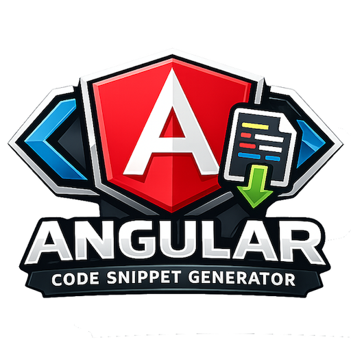


<p align="center">
  
</p>

# Angular Snippet Generator

[](https://www.apache.org/licenses/LICENSE-2.0)
[](https://eslint.org/)
[](https://www.typescriptlang.org/)
[](https://prettier.io/)

## Overview

Angular Snippet Generator is a Visual Studio Code extension designed to streamline
Angular development by automatically generating code snippets from component, directive, and pipe source files.
It simplifies repetitive tasks, improves productivity, and ensures consistency in your
Angular projects.

## Features

- **Automatic Snippet Generation**: Parses Angular components, directives, and pipes.
- **Input/Output Detection**: Extracts `@Input()` and `@Output()` decorated properties.
- **Type-Aware**: Generates appropriate snippet placeholders based on property types.
- **Get Accessor Support**: Handles getter-based input properties.

## Getting Started

### Prerequisites

- **Node.js**: Ensure you have Node.js installed. [Download Node.js](https://nodejs.org/)
- **Visual Studio Code**: Install VS Code. [Download VS Code](https://code.visualstudio.com/)

### Installation

1. Clone the repository:

   ```bash
   git clone https://github.com/Coderrob/angular-snippet-generator.git
   ```

2. Navigate to the project directory:

   ```bash
   cd angular-snippet-generator
   ```

3. Install dependencies:

   ```bash
   npm install
   ```

### Usage

1. Open the project in VS Code.
2. Press `F5` to launch the Extension Development Host.
3. In the new VS Code window, open an Angular project.
4. **Right-click on any folder** in the Explorer sidebar.
5. Navigate to the **"Code Snippets"** submenu at the bottom of the context menu.
6. Select **"Create Angular Snippets"**.
7. The extension will:
   - Scan the folder recursively for Angular files (`.component.ts`, `.directive.ts`, `.pipe.ts`)
   - Parse each file to extract inputs, outputs, and metadata
   - Generate VS Code snippets with proper tab stops and placeholders
   - Save the snippets based on your configuration (see below)
8. Start typing the component selector, directive attribute, or pipe name in any HTML file to use the generated snippets.

### Configuration

Configure where snippets are saved via VS Code settings:

| Setting | Options | Description |
| ------- | ------- | ----------- |
| `angularSnippetGenerator.snippetLocation` | `workspace` (default) | Save to `.vscode/angular.code-snippets` in your project |
| | `user` | Save to your global VS Code user snippets folder |
| | `ask` | Prompt each time to choose the location |

**Workspace (`.vscode` folder)** is recommended for team projects because:

- Snippets are project-specific and relevant to your Angular components
- Can be committed to version control and shared with teammates
- Keeps your global snippets folder clean

**User snippets** are useful when you want snippets available across all projects.

### Generated Snippet Example

For a component like:

```typescript
@Component({
  selector: 'app-save-button'
})
export class SaveButtonComponent {
  @Input() label: string;
  @Input() disabled: boolean;
  @Output() save = new EventEmitter<void>();
}
```

The extension generates a snippet that expands to:

```html
<app-save-button
  [label]="$1"
  [disabled]="${2|true,false|}"
  (save)="$3:onSave($event)"
></app-save-button>
```

## Development

### Available Scripts

| Script | Description |
| ------ | ----------- |
| `npm run compile` | Build the extension with webpack |
| `npm run watch` | Watch mode for development |
| `npm run lint` | Run ESLint and code duplication checks |
| `npm run lint:fix` | Auto-fix ESLint issues |
| `npm run format` | Format code with Prettier |
| `npm run test:unit` | Run unit tests |
| `npm run coverage` | Run tests with coverage report |
| `npm run package` | Create production build |

### Running Tests

```bash
# Run the full test pipeline (compile, build, lint, tests)
npm test
```

## Code Quality

This project enforces strict code quality standards:

### Linting & Formatting

- **ESLint 9.x** with flat config format
- **Prettier** for consistent code formatting
- **JSDoc** required for function declarations, method definitions, and classes
- **Import sorting** with `import/order` and `sort-imports`

### Testing

- **Mocha** test framework with TDD style
- **VS Code test runner** via `@vscode/test-electron`
- **95%+ code coverage** enforced by c8 (lines, branches, functions, statements)

### Code Duplication

- **jscpd** checks for code duplication

## Project Structure

```text
src/
  extension.ts    # VS Code extension entry point
  files.ts        # File system utilities
  nodes.ts        # TypeScript AST node utilities
  parser.ts       # Angular metadata parser
  snippet.ts      # Snippet generation logic
  strings.ts      # String manipulation utilities
  types.ts        # Type definitions and enums
  test/
    suite/        # Unit tests
```

## Best Practices

### Architecture

- **Composition over inheritance**: Functions compose smaller utilities.
- **Dependency injection**: File system operations use injectable providers.
- **Pure functions**: Side-effect-free logic for testability.
- **Single responsibility**: Each module has a focused purpose.

### Code Standards

- JSDoc is required for function declarations, method definitions, and classes.
- TypeScript strict mode is enabled in `tsconfig.json`.

### Testing Standards

- Test descriptions follow "should ..." patterns.
- Cover positive cases, negative cases, and edge cases.
- Mock external dependencies (file system, VS Code API).

## Support

If you encounter any issues or have questions, please open an issue on the
[GitHub repository](https://github.com/Coderrob/angular-snippet-generator/issues).

## Troubleshooting

### The "Code Snippets" menu doesn't appear in the context menu

1. **Reload VS Code**: Press `Ctrl+Shift+P` (or `Cmd+Shift+P` on Mac), type "Developer: Reload Window", and select it.
2. **Check extension is enabled**: Open the Extensions view (`Ctrl+Shift+X`), search for "Angular Snippet Generator", and ensure it's enabled.
3. **Right-click on a folder**: The menu only appears when right-clicking on folders in the Explorer sidebar, not on files or empty space.

### No snippets are generated

- **Verify Angular files exist**: The extension only processes files ending in `.component.ts`, `.directive.ts`, or `.pipe.ts`.
- **Check for valid decorators**: Files must contain `@Component()`, `@Directive()`, or `@Pipe()` decorators with proper metadata.
- **Ensure files have selectors/names**: Components and directives need a `selector` property; pipes need a `name` property.

### Snippets aren't appearing in IntelliSense

1. **Reload VS Code** after generating snippets.
2. **Check snippet location**: If saved to workspace (`.vscode/angular.code-snippets`), ensure the file exists.
3. **Verify file scope**: Generated snippets are scoped to `html` files. Make sure you're in an HTML file.
4. **Type the prefix**: Start typing the component selector, directive attribute, or pipe name to trigger the snippet.

### Extension not activating

- **Check VS Code version**: This extension requires VS Code 1.76.0 or higher.
- **View Output logs**: Open the Output panel (`Ctrl+Shift+U`) and select "Extension Host" from the dropdown to see any activation errors.

## Contributing

1. Fork the repository.
2. Create a feature branch (`git checkout -b feature/amazing-feature`).
3. Ensure tests pass (`npm test`).
4. Ensure linting passes (`npm run lint`).
5. Commit changes (`git commit -m 'Add amazing feature'`).
6. Push to branch (`git push origin feature/amazing-feature`).
7. Open a Pull Request.

## License

This project is licensed under the Apache 2.0 License - see the [LICENSE](LICENSE) file for details.

## Ownership

This repository is maintained by **Rob "Coderrob" Lindley**. For inquiries, please contact via GitHub.
